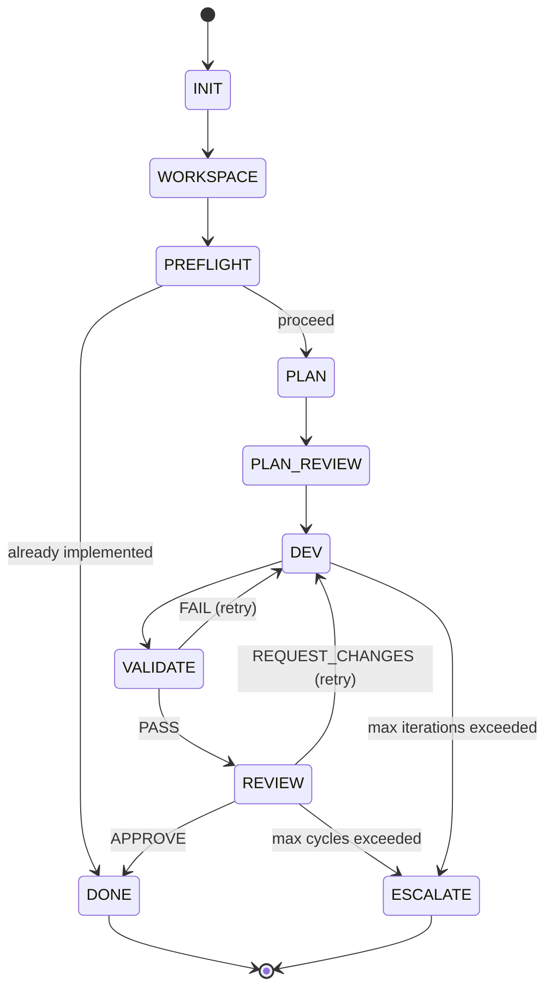
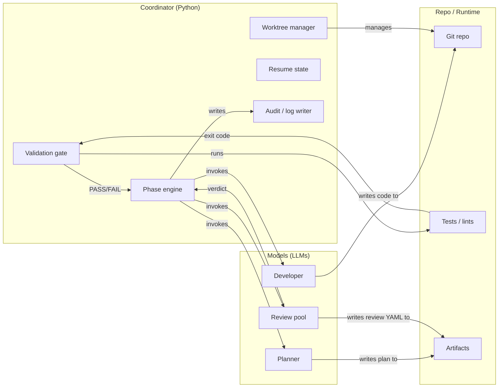

# TheForge

[](https://github.com/fuzzypete/theforge/actions/workflows/ci.yml)
[](https://www.python.org)
[](LICENSE)
[](CHANGELOG.md)

**Deterministic multi-LLM development orchestrator.**

TheForge runs a strict software development pipeline — plan, implement, validate,
review — where **Python code makes all process decisions** and AI agents only
write code and write reviews. Every state transition is mechanical. Every run is
auditable and resumable.

- LLMs generate — they don't control
- Phase gates enforce boundaries mechanically
- Full audit trail on every run
- Interrupted runs resume from where they left off

---

## Is TheForge for you?

**Best for:**
- Bounded feature work and bug fixes with clear acceptance criteria
- Repos with a runnable test/lint suite (pytest, jest, go test, etc.)
- Teams that want auditability: cost tracking, reviewer verdicts, per-phase logs
- Anyone who wants multi-model code review without the copy/paste friction

**Not ideal for:**
- Vague greenfield ideation without acceptance criteria
- Repos with no deterministic validation step
- Giant unscoped refactors without a clear done condition
- UX-heavy exploratory work where "correct" is subjective

---

## 5-minute quickstart

### 1. Install

```bash
pip install git+https://github.com/fuzzypete/theforge.git
```

Or for development:

```bash
git clone https://github.com/fuzzypete/theforge.git
cd theforge
pip install -e ".[dev]"
```

You need at least one AI CLI:
- [Claude Code](https://docs.anthropic.com/en/docs/claude-code) (`claude`) — recommended to start
- [Codex CLI](https://github.com/openai/codex) (`codex`) — optional
- [Gemini CLI](https://github.com/google-gemini/gemini-cli) (`gemini`) — optional

> **You don't need all providers.** A single Claude CLI handles both dev and review.

**Supported:** Python 3.11+ · macOS, Linux

### 2. Check providers

```bash
forge check-providers
```

Smoke-tests your configured AI providers. Fix any failures before running stories.

### 3. Run the hello-forge example

The fastest way to see TheForge in action:

```bash
cd examples/hello-forge
forge run specs/add-greeting.md --verbose
```

See [examples/hello-forge/README.md](examples/hello-forge/README.md) for prerequisites
and expected output. See [First-Run Walkthrough](docs/guides/first-run-walkthrough.md)
for a narrated phase-by-phase transcript.

### 4. Run your own story

```bash
cd your-project
forge init                              # creates forge.yaml and specs/TEMPLATE.md
forge run specs/my-feature.md --verbose
```

**Expected output:**

```
[forge] ▸ WORKSPACE   my-feature
[forge] ▸ PREFLIGHT   sonnet
[forge]   Verdict: PROCEED
[forge] ▸ DEV         sonnet  iter 1
[forge]   ↳ Read: src/app.py
[forge]   ↳ Edit: src/app.py
[forge]   ↳ Write: tests/test_feature.py
[forge] ▸ VALIDATE    pytest
[forge]   Gate: PASS (12 passed in 0.8s)
[forge] ▸ REVIEW      opus
[forge]   ✓ REVIEW   APPROVE  0 P1  $1.23  3m 42s
[forge] ▸ DONE        my-feature
```

---

## How it works



**The coordinator (pure Python) drives everything.** It creates worktrees, invokes
agents, runs gates, and decides what happens next. Agents only write code and write
reviews — they make no process decisions.

### Control boundaries



---

## What gets created

```
your-project/
├── forge.yaml                    # user-authored — project config
├── specs/                        # user-authored — story inputs
│   └── my-feature.md
├── sprints/                      # user-authored — sprint manifests
├── briefs/                       # user-authored — ideation inputs
│
├── .forge/
│   ├── .env                      # user-authored — API keys (gitignored)
│   ├── hooks/                    # user-authored — lifecycle hooks
│   ├── logs/                     # generated — per-run log files
│   └── worktrees/                # generated — managed git worktrees
│       └── my-feature/           # ephemeral — safe to delete after merge
│           ├── forge_audit.yaml  # generated — full run audit trail
│           └── handoff.yaml      # generated — gate output
│
└── forge_audit.yaml              # generated — audit trail (root copy)
```

| Entry | Owner | Safe to delete? | Persists? |
|-------|-------|----------------|-----------|
| `forge.yaml` | You | No | Yes |
| `specs/`, `sprints/`, `briefs/` | You | No | Yes |
| `.forge/.env` | You | No | Yes |
| `.forge/hooks/` | You | No | Yes |
| `.forge/logs/` | Generated | Yes (after review) | Yes |
| `.forge/worktrees/<slug>/` | Generated | Yes (after merge) | Ephemeral |
| `forge_audit.yaml` | Generated | Yes | Per-run |
| `handoff.yaml` | Generated | Yes | Per-run |

> **Mental model:** TheForge is a coordinator, not an autonomous IDE. Each phase
> has a narrow job. Models produce artifacts — they have no runtime authority.
> Validation and review are gates, not suggestions.

See [Runtime Artifacts](docs/guides/getting-started.md#what-gets-created) for full details.

---

## What things cost

| Complexity | Dev (Sonnet) | Review (Opus) | Total |
|-----------|-------------|--------------|-------|
| Small (1-2 files) | $0.50-1.50 | $0.30-0.80 | ~$1-2 |
| Medium (3-8 files) | $1.50-4.00 | $0.50-1.50 | ~$2-6 |
| Large (8+ files) | $3.00-8.00 | $1.00-3.00 | ~$5-12 |

Budget enforcement is built in — set `budget_usd` per profile to control spend.

---

## Documentation

| Guide | Description |
|-------|-------------|
| [Getting Started](docs/guides/getting-started.md) | Full walkthrough: install → first run → merge |
| [CLI Reference](docs/guides/cli-reference.md) | All commands, flags, and "use this when" guidance |
| [Inputs Reference](docs/guides/inputs-reference.md) | Every file format: stories, sprints, config, briefs |
| [First-Run Walkthrough](docs/guides/first-run-walkthrough.md) | Narrated phase-by-phase terminal transcript |
| [Troubleshooting](docs/guides/troubleshooting.md) | Symptom → cause → fix for common problems |
| [Provider Setup Guide](docs/guides/choose-your-provider-setup.md) | Pick the right provider pattern for your situation |
| [Local Models](docs/guides/local-models.md) | Ollama and vLLM setup for private/offline use |
| [Vision](docs/vision.md) | Architecture philosophy, roadmap, principles |
| [Example Project](examples/hello-forge/) | Self-contained example you can run immediately |

---

## Configuration

TheForge is configured via `forge.yaml` in your project root. `forge init`
generates a minimal config. Key sections:

```yaml
profiles:
  dev:                          # who implements
    cli: claude
    model: sonnet
    budget_usd: 5.00
  review_pool:                  # who reviews (1 or more)
    - name: claude-reviewer
      cli: claude
      model: opus
      budget_usd: 2.00

retry:
  max_dev_iterations: 3         # attempts before escalation
  max_review_cycles: 2          # dev→review loops

validation:
  gate_command: "pytest tests/"  # your test command
```

> **Terminology note:** Stories live in `specs/` by convention — but the primary
> term throughout the codebase and documentation is "story." The `specs/` directory
> name is a filesystem convention, not a different concept.

See [Inputs Reference](docs/guides/inputs-reference.md) for the full config
schema with all options. See [Provider Setup Guide](docs/guides/choose-your-provider-setup.md)
to pick the right provider pattern.

### Multi-model review

Different models catch different bugs. Add reviewers to the review pool:

```yaml
  review_pool:
    - name: claude-reviewer
      cli: claude
      model: opus
      review_role: correctness
    - name: codex-reviewer
      provider: openai         # API mode — TheForge provides tool runtime
      model: o4-mini
      review_role: patterns
    - name: gemini-reviewer
      provider: google
      model: gemini-2.5-flash
      review_role: edge-cases
```

A single P1 from any reviewer triggers REQUEST_CHANGES. P2s are advisory.

### API keys

For API-mode agents, set up secrets:

```bash
forge secrets-init              # creates .forge/.env (gitignored)
```

CLI-mode agents (Claude Code, Codex CLI) handle their own authentication.

---

## Architecture

```
src/theforge/
├── coordinator.py     Deterministic state machine — the heart of the system
├── runner.py          CLI agent subprocess invocation
├── runner_api.py      API agent runner with tool-use loop
├── tool_runtime.py    Tool registry and handlers for API agents
├── config.py          forge.yaml parsing and model profiles
├── task.py            Prompt builders (dev, preflight, review, plan review)
├── review.py          Review output parsing and normalization
├── schemas.py         Review schema validation
├── sprint.py          Sprint manifest loading and execution
├── cli.py             forge CLI entry point
└── ...                Support modules (state, phases, logging, audit)
```

**Key invariant:** The coordinator is not an LLM. Every state transition is
deterministic Python. If an LLM is deciding whether to retry or escalate,
the architecture is wrong.

---

## Development

TheForge develops itself. The `forge.yaml` in this repo configures a 4-model
review pool (Claude, Codex, Gemini, DeepSeek) and plans phase. Stories live in
`specs/`, sprints in `sprints/`.

```bash
make fmt        # ruff format + ruff check --fix
make lint       # ruff check + ruff format --check
make test       # pytest tests/ -v
make gate       # run tests + write handoff.yaml
```

---

## License

[MIT](LICENSE)
