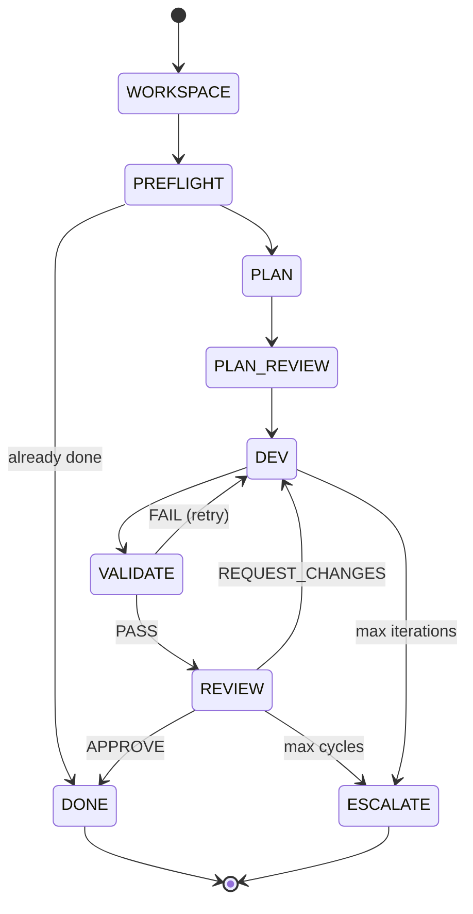

# TheForge

[](https://github.com/fuzzypete/theforge/actions/workflows/ci.yml)
[](https://www.python.org)
[](LICENSE)
[](CHANGELOG.md)

**Deterministic multi-LLM development orchestrator.**

TheForge runs a strict software development pipeline where Python coordinates
the process and models stay inside bounded roles: plan, implement, validate,
review. Every state transition is mechanical. Every run is auditable, resumable,
and isolated in a git worktree until you decide to merge.

- LLMs generate artifacts, not process decisions
- Validation and review act as mechanical gates
- Work happens on feature branches in managed worktrees
- Logs, audits, and review output make every run inspectable

## Why TheForge

- Keep orchestration deterministic even when model behavior is not
- Separate coding from control flow, retries, and escalation
- Add cross-model review without manual copy/paste loops
- Leave a concrete audit trail behind every story run

## Is this for you?

**Best fit**
- Bounded feature work and bug fixes with clear acceptance criteria
- Repos with a runnable test or lint gate
- Teams that want auditability, resumability, and explicit review loops
- People who want multi-model review without giving models runtime authority

**Poor fit**
- Vague exploratory work without a clear done condition
- Repos with no deterministic validation step
- Huge refactors whose scope is still moving
- Design-heavy work where correctness is mostly subjective

## 5-minute quickstart

### 1. Install

```bash
pip install git+https://github.com/fuzzypete/theforge.git
```

For development:

```bash
git clone https://github.com/fuzzypete/theforge.git
cd theforge
pip install -e ".[dev]"
```

You need at least one AI CLI. Starting with Claude Code is the simplest path.

### 2. Check provider health

```bash
forge check-providers
```

### 3. Run the canonical example

```bash
cd examples/hello-forge
forge run specs/add-greeting.md --verbose
```

Start with [examples/hello-forge/README.md](examples/hello-forge/README.md) if
you want the fastest proof that your setup is sane before pointing TheForge at
a real repository.

### 4. Run your own story

```bash
cd your-project
forge init
forge run specs/my-feature.md --verbose
```

Expected shape of a successful run:

```text
[forge] ▸ WORKSPACE   my-feature
[forge] ▸ PREFLIGHT   sonnet
[forge]   Verdict: PROCEED
[forge] ▸ DEV         sonnet  iter 1
[forge] ▸ VALIDATE    pytest
[forge]   Gate: PASS
[forge] ▸ REVIEW      opus
[forge]   ✓ REVIEW   APPROVE
[forge] ▸ DONE        my-feature
```

## How a run works

The public-facing lifecycle is intentionally simple:

```text
INIT -> WORKSPACE -> PREFLIGHT -> PLAN -> PLAN_REVIEW
  -> DEV -> VALIDATE -> REVIEW -> DONE / ESCALATE
```

The coordinator creates a worktree, invokes the configured agents, runs your
gate command, parses structured review output, and decides what happens next.
Models do the planning, coding, and reviewing, but they do not decide whether
to retry, pass a gate, or escalate. When validation fails or review requests
changes, the run can loop back to `DEV` before it finishes.



## What gets created

```text
your-project/
|- forge.yaml
|- specs/
|- sprints/
`- .forge/
   |- .env
   |- hooks/
   |- logs/
   |- audits/
   `- worktrees/
```

- `forge.yaml`, `specs/`, `sprints/`, and `.forge/.env` are yours.
- `.forge/logs/`, `.forge/audits/`, and `.forge/worktrees/` are generated by TheForge.
- Worktrees are where agent edits happen, so your main branch stays untouched until you merge.
- The latest persistent audit lands in `.forge/audits/forge_audit.yaml`.

See [Getting Started](docs/guides/getting-started.md#what-gets-created) for the
full ownership and cleanup breakdown.

## Choose your setup

| Setup | Best for | Tradeoff |
|-------|----------|----------|
| Single CLI | Fastest first run | Fewer comparison angles in review |
| Multi-CLI review | Cross-model review coverage | More local setup friction |
| API reviewers/runtime | Fine-grained control and hosted providers | More env and secret management |

See [Provider Setup Guide](docs/guides/choose-your-provider-setup.md) for
recommended patterns.

## Minimal config

This is the smallest useful mental model for `forge.yaml`:

```yaml
profiles:
  dev:
    cli: claude
    model: sonnet
  review_pool:
    - name: claude-reviewer
      cli: claude
      model: opus

validation:
  gate_command: "pytest tests/"
```

Add more reviewers for cross-model coverage, or switch to API-mode profiles
when you want hosted providers and tool-runtime control. The full schema lives
in [Inputs Reference](docs/guides/inputs-reference.md).

## What things cost

| Complexity | Dev (Sonnet) | Review (Opus) | Total |
|-----------|-------------|--------------|-------|
| Small (1-2 files) | $0.50-1.50 | $0.30-0.80 | ~$1-2 |
| Medium (3-8 files) | $1.50-4.00 | $0.50-1.50 | ~$2-6 |
| Large (8+ files) | $3.00-8.00 | $1.00-3.00 | ~$5-12 |

Actual cost varies a lot with repo shape, validation runtime, diff size, prompt
volume, and the number of review loops. Budget enforcement is built in via
`budget_usd`.

## Start here

| Guide | Description |
|-------|-------------|
| [Getting Started](docs/guides/getting-started.md) | Full first-run walkthrough from install to merge |
| [Example Project](examples/hello-forge/) | Canonical proof path for a fresh setup |
| [First-Run Walkthrough](docs/guides/first-run-walkthrough.md) | Narrated phase-by-phase terminal transcript |
| [Troubleshooting](docs/guides/troubleshooting.md) | Recovery guidance for setup, gate, and worktree issues |
| [CLI Reference](docs/guides/cli-reference.md) | Commands, flags, and when to use them |
| [Inputs Reference](docs/guides/inputs-reference.md) | Story, sprint, config, and brief file formats |
| [Provider Setup Guide](docs/guides/choose-your-provider-setup.md) | Choosing between CLI and API patterns |
| [Local Models](docs/guides/local-models.md) | Ollama and vLLM setup for private or offline use |
| [Vision](docs/vision.md) | Philosophy, architecture principles, and roadmap |

## Developing TheForge

The repo configures TheForge to develop itself. The most useful local commands are:

```bash
make fmt
make lint
make test
make gate
```

Core modules:

```text
src/theforge/
|- coordinator.py   deterministic state machine
|- runner.py        CLI agent subprocess runner
|- runner_api.py    API-mode agent runner
|- config.py        forge.yaml parsing and profiles
|- task.py          prompt builders
|- review.py        review parsing and normalization
|- schemas.py       review schema validation
`- cli.py           forge CLI entry point
```

Key invariant: the coordinator is not an LLM. If a model is deciding whether
to retry, pass a gate, or escalate, the architecture is wrong.

## License

[MIT](LICENSE)
