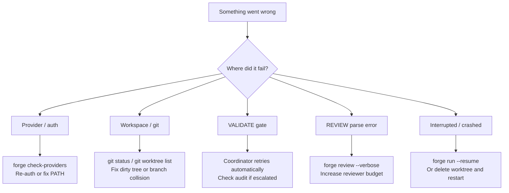

# Troubleshooting

Symptom → likely cause → fix. Jump to the section that matches your problem.

- [Install / environment](#install--environment)
- [Provider / auth](#provider--auth)
- [Repo / workspace](#repo--workspace)
- [Execution](#execution)
- [Cost / performance](#cost--performance)
- [Cleanup / recovery](#cleanup--recovery)

---

## Install / environment

### `forge: command not found`

**Cause:** TheForge isn't installed, or the install location isn't on PATH.

**Fix:**
```bash
pip install -e /path/to/theforge    # editable install for development
# or
pip install git+https://github.com/fuzzypete/theforge.git

# Verify
forge --help
```

If `forge` still isn't found after install, check that your Python scripts
directory is on PATH:
```bash
python -m site --user-base       # shows install prefix
# Add <prefix>/bin to your PATH
```

---

### Editable install issues (`ImportError`, missing modules)

**Cause:** Install ran but package wasn't properly linked.

**Fix:**
```bash
pip install -e ".[dev]"           # reinstall in editable mode
python -c "import theforge"       # verify import works
```

---

### Wrong Python version

**Cause:** TheForge requires Python 3.12+.

**Fix:**
```bash
python --version                  # must be 3.12+
# Use pyenv or conda to switch Python versions if needed
pyenv install 3.12.8
pyenv local 3.12.8
pip install -e ".[dev]"
```

---

### Dependency conflict / broken environment

**Cause:** Version conflict in the Python environment.

**Fix:**
```bash
# Create a fresh virtual environment
python -m venv .venv
source .venv/bin/activate
pip install -e ".[dev]"
```

---

### Config load fails: `workspace.setup_command uses {forge_python} but workspace.python_interpreter ...`

**Symptom:** `forge.yaml` fails to load with this error.

**Cause:** The project's `setup_command` references `{forge_python}` but does
not declare which interpreter the project develops against. TheForge fails
closed here rather than substituting the orchestrator's own interpreter —
the orchestrator's runtime must not decide which Python the project's gate
runs under.

**Fix:**
```yaml
workspace:
  python_interpreter: "python3.12"   # the interpreter this project develops against
  setup_command: "{forge_python} -m pip install -e ."
```

---

## Provider / auth

### Provider binary not on PATH

**Symptom:** `forge check-providers` fails with "binary not found" or similar.

**Cause:** The AI CLI (claude, codex, gemini) is not installed or not on PATH.

**Fix:**
```bash
# Verify the binary is findable
which claude       # or codex, gemini
claude --version

# If missing, install the CLI:
# Claude Code: https://docs.anthropic.com/en/docs/claude-code
# Codex CLI:   https://github.com/openai/codex
# Gemini CLI:  https://github.com/google-gemini/gemini-cli
```

---

### Auth expired / re-authentication needed

**Symptom:** `forge check-providers` shows `401 Unauthorized` or similar.

**Cause:** CLI session expired or API key rotated.

**Fix:**

For the Claude CLI, put a long-lived token in `.forge/.env` — that is the
credential path forge reads (`CLAUDE_CODE_OAUTH_TOKEN`, or `ANTHROPIC_API_KEY`
for API billing). Generate one with the CLI's token flow:

```bash
claude setup-token
# paste the token into .forge/.env as CLAUDE_CODE_OAUTH_TOKEN=...
```

Avoid re-running interactive `claude` auth with the credential forge uses:
interactive auth flows rotate the shared OAuth token family and are a known
cause of revoking the forge credential, not a cure.

```bash
# API-mode providers — update key in .forge/.env
forge secrets-init
# then edit .forge/.env with fresh keys

# Retest
forge check-providers
```

---

### CLI opens but TheForge cannot invoke it

**Symptom:** Running the CLI manually works, but forge hangs or errors on first
agent invocation.

**Cause:** PATH in the forge subprocess differs from your shell PATH (common on
macOS with GUI apps or in some CI environments).

**Fix:** `cli:` accepts only a runner name (`claude`, `codex`, `gemini`,
`ghaw`) — an absolute path is rejected at config load. Fix PATH for the
environment forge actually runs in instead:

```bash
# Find where the binary lives
which claude

# Ensure that directory is on PATH in your shell profile
# (~/.zshrc / ~/.bashrc) for foreground runs.
# GUI-launched and launchd/CI environments have their own PATH —
# set it there too if forge runs outside your login shell.

# Verify from forge's perspective
forge check-providers
```

---

### API key / env not loaded

**Symptom:** API-mode agents fail with auth errors despite key being set.

**Cause:** `.forge/.env` not created, or you still have a legacy
`.forge/secrets.yaml` that was never migrated.

**Fix:**
```bash
forge secrets-init               # creates .forge/.env
cat .forge/.env                  # verify key is present and non-empty
# TheForge loads .forge/.env automatically — no manual export needed
```

If you still have `.forge/secrets.yaml`, copy those values into `.forge/.env`
and remove the old file.

---

### `forge check-providers` failures

**Symptom:** One or more providers report errors.

**Cause:** Various — see specific error message.

**Fix:**
```bash
forge check-providers            # smoke-tests every API-mode profile
forge check-providers --profile dev  # test a single profile
```

Common errors:
| Error | Fix |
|-------|-----|
| `binary not found` | Install the CLI and ensure its directory is on `PATH` for the forge process (`cli:` accepts runner names only, never paths — see "CLI opens but TheForge cannot invoke it") |
| `401 Unauthorized` | Re-auth or refresh API key |
| `timeout` | Provider is slow; increase `timeout_seconds` in profile |
| `model not found` | Check model name spelling in forge.yaml |

---

## Repo / workspace

### Not in a git repository

**Symptom:** `forge run` fails with "not a git repo" error.

**Cause:** The project directory (or hello-forge example) isn't a git repo.

**Fix:**
```bash
git init
git add -A
git commit -m "initial"
```

---

### Dirty working tree

**Symptom:** `git worktree add` fails with "dirty index" or similar.

**Cause:** Uncommitted changes in the repo prevent worktree creation.

**Fix:**
```bash
git status                        # see what's uncommitted
git add -A && git commit -m "wip: before forge run"
# or stash
git stash
```

---

### Worktree branch collision

**Symptom:** `git worktree add` fails with "branch already exists."

**Cause:** A previous run left a branch/worktree behind.

**Fix:**
```bash
# Remove the stale worktree
git worktree remove .forge/worktrees/<slug> --force
git branch -D forge/<slug>

# Then rerun
forge run stories/my-feature.md --verbose
```

---

### Detached HEAD

**Symptom:** Git operations fail with "HEAD is detached."

**Cause:** The base branch (`main`) has a detached HEAD.

**Fix:**
```bash
git checkout main
```

---

## Execution

### PLAN failed

**Symptom:** `[forge] ✗ PLAN` — plan phase returned an error or empty output.

**Cause:** The planning model didn't produce valid output, hit a budget cap, or
timed out.

**Fix:**
- Check `--verbose` output for the raw agent response
- Increase `budget_usd` or `timeout_seconds` in the `plan:` profile
- If story is very large, split it into smaller stories

---

### DEV timed out

**Symptom:** `[forge] ✗ DEV` — development phase exceeded `timeout_seconds`.

**Cause:** Complex story, slow provider, or agent got stuck in a loop.

**Fix:**
```bash
# Increase timeout in forge.yaml
profiles:
  dev:
    timeout_seconds: 1800   # shipped default is 900

# Or resume from where it left off
forge run stories/my-feature.md --resume --verbose
```

If you want to watch the run live instead of letting it detach, use `--fg`.

---

### Run detached and I can't see output

**Symptom:** `forge run` or `forge sprint` returned quickly, but work appears to
still be running in the background.

**Cause:** Detached execution is the default unless you pass `--fg`.

**Fix:**
```bash
forge status
forge logs <run-id>
forge stop <run-id>      # if you need to terminate it

# Next time, stay attached:
forge run stories/my-feature.md --fg --verbose
```

For sprints, `--no-pull` is also useful in offline or CI environments where
you don't want fresh worktrees to `git pull --ff-only`.

---

### VALIDATE failed (gate FAIL)

**Symptom:** `[forge] Gate: FAIL` — tests or lints didn't pass.

**Cause:** The dev agent's implementation has bugs. The gate is coordinator-owned,
so the dev only sees the result when VALIDATE hands it back — which it does
automatically, up to `max_dev_iterations` within the cycle. Once those are spent
the finding buys a review cycle (the dev iteration pool refills with it), up to a
ceiling of `max_dev_iterations × max_review_cycles` attempts.

A story stops short of that ceiling when the gate stops moving: if two
consecutive iterations produce byte-identical gate output, the coordinator will
not buy another review cycle, because a further pool of iterations would spend
the full cross-product to learn what the repeated output already says. A
lint- or format-only failure that the dev does not change is the common case —
it escalates after `max_dev_iterations` attempts, not the full ceiling. The
escalation message names which of the two stopped it.

**Fix:** Usually self-correcting. If it escalates:
```bash
cd .forge/worktrees/<slug>
python -m pytest tests/ -v        # see which tests fail
# Read the audit for what the agent attempted
cat forge_audit.yaml
```

---

### REVIEW failed to parse / schema error

**Symptom:** `[forge] Review parse error` — review output wasn't valid YAML.

**Cause:** The reviewing model produced malformed output, or the output was
truncated by a budget/token limit.

**Fix:**
- Increase `budget_usd` for the reviewer profile
- Run `forge review stories/my-feature.md --verbose` to retry review only
- Check the raw review output in `forge_audit.yaml`

---

### ESCALATE triggered

**Symptom:** `[forge] ▸ ESCALATE` — max iterations or review cycles exceeded.

**Cause:** The dev agent couldn't produce passing code within the retry budget,
or reviewers kept finding P1 issues.

**Fix:**
```bash
# Inspect what happened
cat .forge/worktrees/<slug>/forge_audit.yaml

# Refine the story and try again (story may be too vague or too large)
# Or make manual fixes in the worktree, then re-review
forge review stories/my-feature.md --verbose
```

---

### Story refuses at entry with LANDING PRECONDITION, or ends in MERGE_FAILED

**Symptom:** Under a landing workflow (`workspace.on_approve: merge` or
`--auto-merge`), a story escalates in `WORKSPACE` with
`LANDING PRECONDITION: uncommitted changes in project root …` — or, more
rarely, a story that passed gate and review ends in `MERGE_FAILED`.

**Cause:** Merge steps run in the base checkout, so uncommitted changes there
(often a `forge.yaml` or config edit made mid-sprint) block landing. Since
#2048 that condition is checked at each story's *entry*: the sprint refuses in
`WORKSPACE`, names the offending paths, and spends nothing. A story that still
reaches `MERGE_FAILED` means the root was dirtied after that story entered, or
the landing failed for a genuine reason (e.g. a real conflict with the base
branch).

Forge's own pending bookkeeping does *not* count as dirt (#2775). Paths under
`.forge/audits/runs/`, `.forge/audits/landing/` and `.forge/knowledge/summaries/`
are written by a run as it finishes and published by that run, so they are
excluded from the condition everywhere it is evaluated. If a refusal names a
mix, only the paths outside those three directories are yours to clear.

**Fix:**
```bash
git status                        # in the project root, not the worktree
git add -A && git commit -m "config edits"
# or: git stash
```

Commit or stash config edits before starting a sprint. On `MERGE_FAILED` the
story's branch is intact — clean the root (or resolve the conflict) and re-run
the merge. See the landing-precondition section of the
[controller runbook](controller-runbook.md) for the full semantics.

---

### Resume confusion

**Symptom:** `--resume` restarts from an unexpected phase, or repeats work.

**Cause:** Resume detects worktree state heuristically — if the worktree was
modified manually, state detection may be off.

**Fix:** See [Resume Behavior](#resume-behavior) below for the full state matrix.
For a guaranteed clean start: delete the worktree and rerun without `--resume`.

---

## Resume behavior

| Interrupted state | Resume behavior | Notes |
|-------------------|-----------------|-------|
| During PLAN | Reruns PLAN | Plan output not persisted until complete |
| During DEV | Reruns DEV iter from scratch | Dev prompt re-sent; previous partial edits are in worktree |
| Failed VALIDATE (gate FAIL) | Reruns DEV with gate failure context | Correct — this is the normal retry path |
| Failed REVIEW parse / schema error | Reruns REVIEW | Review is re-invoked; no dev iteration consumed |
| REVIEW returned REQUEST_CHANGES | Reruns DEV with P1 findings | Correct — this is the normal review loop |
| Provider crashed / timed out mid-phase | Reruns the crashed phase | Safe; phase is idempotent from coordinator's perspective |
| Stale worktree from previous run | Resumes from last confirmed phase | May produce unexpected results if story changed |
| Manual human edits made to worktree | Resumes from VALIDATE | Coordinator sees edited state; may produce odd dev output |

**Force a clean restart:**
```bash
git worktree remove .forge/worktrees/<slug> --force
git branch -D forge/<slug>
forge run stories/my-feature.md --verbose   # no --resume
```

---

## Cost / performance

### Run is slow

**Cause:** Large stories, slow providers, or high `timeout_seconds` values.

**Fix:**
- Use faster models for dev (sonnet vs opus)
- Split large stories into smaller ones
- Use `--dry-run` to see what prompts will be sent before committing to a run

---

### Review loop repeats

**Cause:** Reviewer keeps finding P1 issues after dev fixes.

**Fix:**
- Check the P1 findings in the audit for patterns
- Tighten the story's acceptance criteria so the agent has clearer targets
- Reduce `max_review_cycles` if you want to escalate faster

---

### Cost unexpectedly high

**Cause:** Long dev/review conversations, many retry iterations, or large
review pools.

**Fix:**
- Lower the sprint `budget_usd` — this is the enforced ceiling that stops
  launching new stories once cumulative spend is consumed
- Note: the per-story `budget_usd` on the dev profile is a *cost estimate* used
  for routing/timeout scaling, not a per-story hard cap. Exceeding it does not
  block a story that produced usable work (see the converged budget model in the
  [inputs reference](inputs-reference.md#cost-governance-vs-per-story-estimates-converged-model))
- Use `--dry-run` to estimate prompt sizes before running
- Use a smaller/cheaper model for dev (sonnet instead of opus)

---

### Sprint halts with unmeasured spend / unverifiable budget

**Symptom:** A multi-story sprint stops dispatching with
`spend unmeasured for N source(s) ... the cap cannot be verified`, while the
same stories pass as single-story runs.

**Cause:** When any story's spend could not be measured, the sprint's
accumulated cost is only a lower bound, so the budget cap comparison is
unanswerable — the sprint stops rather than launching more work against a
total it knows is understated (#1992). One unmeasured story is enough, which
is why the failure hides: single-story runs don't aggregate against a sprint
cap, so they pass (#2215).

**Fix:** The halt message names the unmeasured source(s) and, for each, the
measured lower bound, the most it could still have cost, and the call it came
from (`run_id`, phase, role, profile, failure code). Check the per-story audit
under `.forge/audits/runs/` to see why cost went unrecorded, then diagnose that
story's run.

**When the condition is stuck:** an unmeasured source is carried into every
later run of the same sprint, so a story whose reviewer died on (say) a provider
quota error stays unrunnable — the refusal happens after its reuse gate has
already passed. When the unknown is bounded, resolve it deliberately:

```bash
forge sprint sprint.yaml --resume --accept-unmeasured-spend issue-2206 \
  --accept-unmeasured-reason "reviewer hit a provider quota"
```

The source id is the one printed in the refusal; `issue-2206` and
`carried:issue-2206` name the same work. Acceptance charges the source's
recorded ceiling (the story's allocation, less what was measured) to the budget
comparison in place of the unknown — so it never buys headroom, and a sprint
that is genuinely near its cap still stops. It also never relabels the cost as
measured: `cost_complete` stays `false` and the sprint total stays a lower
bound.

Inspect the result in `.forge/audits/sprint-audit.yaml` under `sprint:`:

- `unresolved_unmeasured_spend_sources` — what the guard is still refusing on
- `accepted_unmeasured_spend` — each acceptance with its ceiling, origin
  (`origin_run_id`, `origin_phase`, `origin_role`, `origin_profile`,
  `origin_failure_code`), timestamp and reason
- `budget_verification_spend_usd` — measured spend plus every accepted ceiling;
  the figure the cap was actually verified against

The resolution is persisted per sprint, so a later `--resume` reads it rather
than needing the flag again. A source with no recorded allocation has no
derivable ceiling: it is refused with the reason logged and the guard stays
closed, because accepting an unbounded unknown would defeat the measurement it
stands in for.

---

### Sprint total is `null` with a `cost_accounting_discrepancy` block

**Symptom:** `sprint-audit.yaml` / `sprint-summary.yaml` report
`total_cost_usd: null`, `cost_complete: false`, and a `cost_accounting_discrepancy`
block under `sprint:` — but no story reported unmeasured spend.

**Cause:** The sprint's measured total exceeds what the per-story rows account
for. The total and the rows are the same money counted twice, so a gap means
some amount is in the total with no addressable record behind it. Rather than
render a confident figure assembled from an incomplete set, the writers withhold
the total and name the gap (#2847).

**Fix:** Read the block — it carries `sprint_measured_usd`, `explained_story_usd`,
`declared_non_story_usd` (intake remediation on issues the sprint never
scheduled), `unexplained_usd`, and `stories_without_measured_cost`. The measured
lower bound is still reported under `total_cost_measured_usd`. Then check whether
a story is missing from `specs:` / `stories:` entirely: that, not a bad sum, is
the usual cause, and it is worth filing.

A story the sprint still holds in its own state — one whose issue this
generation's query no longer returns — is written into `specs:` / `stories:`
before that check runs, marked `outcome_source: carried_from_accumulated_state`.
So the discrepancy block reports spend that *no* row explains, not merely spend
whose row this process did not produce.

Related: a story whose GitHub issue closed because *this sprint landed it* stays
a story of the sprint across a re-exec. It keeps its `specs:` row, and
`forge audits show --slug issue-<n>` finds it. Only an issue this sprint never
ran is classified under `closed_dependency_slugs`.

An acceptance covers the **occurrence** it was made for — one recorded call, at
one recorded ceiling, in one recorded run — not the story. If the same story
runs again and *again* finishes with cost unmeasured, that is a second unknown
nobody has bounded, and the guard closes on it exactly as it did the first time,
on that run and on every later resume. A story that keeps needing acceptance is
telling you its transport or provider is not reporting cost; fix that rather
than re-accepting.

You never accept `carried:prior-generation`. That entry is derived — it says
only that *some* source the previous generation named went unmeasured — so it
has no origin and no ceiling of its own. Accept the named sources beside it and
it goes away.

---

### Large diffs degrade quality

**Cause:** Stories that touch many files at once overwhelm the agent's context.

**Fix:** Split the story into multiple focused stories. TheForge works best with
stories that touch 1-5 files.

---

## Cleanup / recovery

### Remove stale worktrees

```bash
# List all worktrees
git worktree list

# Remove a specific stale worktree
git worktree remove .forge/worktrees/<slug> --force
git branch -D forge/<slug>

# Prune all stale worktree references at once
git worktree prune
```

---

### A worktree the sweep preserved

Every WORKSPACE entry sweeps `.forge/worktrees/`. A clean, unlocked,
unescalated worktree is reclaimed once one shared resolver reports its branch
as **landed** — from the audit trail, git topology, a merged PR, or a commit on
the base branch that closes the issue. That covers a squash landing, where the
branch's own commits never reach origin and so the branch is preserved forever
on commit presence alone.

The two external sources — a merged PR and a closing reference — yield to the
branch's own content. A PR counts only when it merged into the base branch this
run is configured against, and only when replaying the branch onto that base is
a no-op; a branch that kept committing after its PR landed still holds work the
base does not have, and its worktree is preserved. The two local sources are not
subject to that check: topology proves containment outright, and the audit
assertion is forge's own record of landing this story.

One narrower reclamation stays local and free: a branch with no commits missing
from origin that is also *contained in* `origin/<base>` holds nothing to lose.
Note the second half — commits reachable from some unrelated origin ref are not
commits that landed on the base branch, so a missing
`refs/remotes/origin/<branch>` is not on its own grounds for removal.

Anything else is preserved, and the log says which:

```
✓ WORKSPACE  feat/issue-2553 landed via merged PR #2577 — reclaimable
⚠ WORKSPACE  preserving worktree feat/issue-9999 — branch content is absent from main; 3 local commits not present on origin
⚠ WORKSPACE  preserving worktree feat/issue-7777 — branch content is absent from main despite merged PR #4242; 2 local commits not present on origin
⚠ WORKSPACE  preserving worktree feat/issue-8888 — landing undecidable — the merged-PR lookup could not run; ...
```

`branch content is absent from main` means the branch's work is provably not in
the base branch — real unlanded work, and the case preservation exists for. When
a merged PR exists anyway, the message names it, because that PR is the claim
you would otherwise reach for when the preservation looks wrong.
`landing undecidable` means nothing could speak for the branch either way; the
message names the evidence that was missing, so a failed `gh` call is not read
as proof that no PR merged. Neither is ever deleted automatically.

---

### Restart a failed run cleanly

```bash
# 1. Remove the worktree
git worktree remove .forge/worktrees/<slug> --force
git branch -D forge/<slug>

# 2. Rerun without --resume
forge run specs/my-feature.md --verbose
```

---

### Inspect logs and audit trail

```bash
# Full per-run audit
cat .forge/worktrees/<slug>/forge_audit.yaml

# Human-readable summary
forge audit .forge/worktrees/<slug>/forge_audit.yaml

# Per-run logs (if logging enabled)
ls .forge/logs/
```

---



---

## See also

- [CLI Reference](cli-reference.md) — correct usage for all commands
- [Getting Started](getting-started.md) — setup walkthrough if something is missing
- [Resume Semantics](cli-reference.md#resume-behavior) — full `--resume` details
