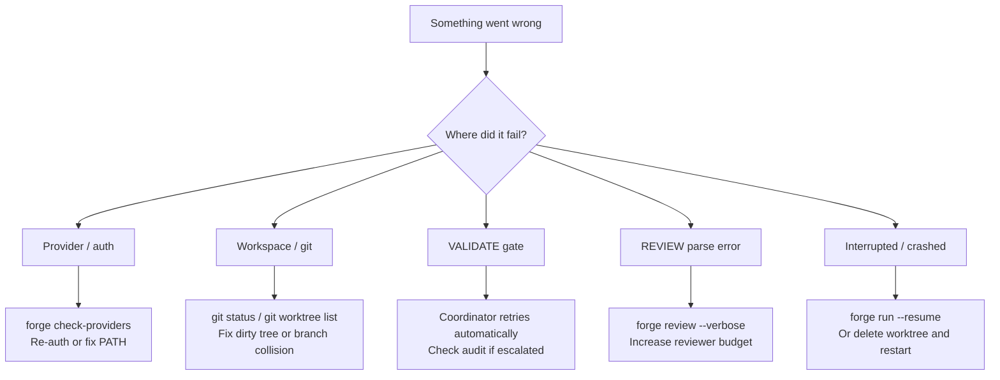

# Troubleshooting

Symptom → likely cause → fix. Jump to the section that matches your problem.

- [Install / environment](#install--environment)
- [Provider / auth](#provider--auth)
- [Repo / workspace](#repo--workspace)
- [Execution](#execution)
- [Cost / performance](#cost--performance)
- [Cleanup / recovery](#cleanup--recovery)

---

## Install / environment

### `forge: command not found`

**Cause:** TheForge isn't installed, or the install location isn't on PATH.

**Fix:**
```bash
pip install -e /path/to/theforge    # editable install for development
# or
pip install git+https://github.com/fuzzypete/theforge.git

# Verify
forge --help
```

If `forge` still isn't found after install, check that your Python scripts
directory is on PATH:
```bash
python -m site --user-base       # shows install prefix
# Add <prefix>/bin to your PATH
```

---

### Editable install issues (`ImportError`, missing modules)

**Cause:** Install ran but package wasn't properly linked.

**Fix:**
```bash
pip install -e ".[dev]"           # reinstall in editable mode
python -c "import theforge"       # verify import works
```

---

### Wrong Python version

**Cause:** TheForge requires Python 3.11+.

**Fix:**
```bash
python --version                  # must be 3.11+
# Use pyenv or conda to switch Python versions if needed
pyenv install 3.11.9
pyenv local 3.11.9
pip install -e ".[dev]"
```

---

### Dependency conflict / broken environment

**Cause:** Version conflict in the Python environment.

**Fix:**
```bash
# Create a fresh virtual environment
python -m venv .venv
source .venv/bin/activate
pip install -e ".[dev]"
```

---

## Provider / auth

### Provider binary not on PATH

**Symptom:** `forge check-providers` fails with "binary not found" or similar.

**Cause:** The AI CLI (claude, codex, gemini) is not installed or not on PATH.

**Fix:**
```bash
# Verify the binary is findable
which claude       # or codex, gemini
claude --version

# If missing, install the CLI:
# Claude Code: https://docs.anthropic.com/en/docs/claude-code
# Codex CLI:   https://github.com/openai/codex
# Gemini CLI:  https://github.com/google-gemini/gemini-cli
```

---

### Auth expired / re-authentication needed

**Symptom:** `forge check-providers` shows `401 Unauthorized` or similar.

**Cause:** CLI session expired or API key rotated.

**Fix:**
```bash
# Claude Code — re-authenticate
claude auth login

# API-mode providers — update key in .forge/.env
forge secrets-init
# then edit .forge/.env with fresh keys

# Retest
forge check-providers
```

---

### CLI opens but TheForge cannot invoke it

**Symptom:** Running the CLI manually works, but forge hangs or errors on first
agent invocation.

**Cause:** PATH in the forge subprocess differs from your shell PATH (common on
macOS with GUI apps or in some CI environments).

**Fix:**
```bash
# Add the CLI's full path to forge.yaml
profiles:
  dev:
    cli: /usr/local/bin/claude    # absolute path
```

---

### API key / env not loaded

**Symptom:** API-mode agents fail with auth errors despite key being set.

**Cause:** `.forge/.env` not created, or you still have a legacy
`.forge/secrets.yaml` that was never migrated.

**Fix:**
```bash
forge secrets-init               # creates .forge/.env
cat .forge/.env                  # verify key is present and non-empty
# TheForge loads .forge/.env automatically — no manual export needed
```

If you still have `.forge/secrets.yaml`, copy those values into `.forge/.env`
and remove the old file.

---

### `forge check-providers` failures

**Symptom:** One or more providers report errors.

**Cause:** Various — see specific error message.

**Fix:**
```bash
forge check-providers            # smoke-tests every API-mode profile
forge check-providers --profile dev  # test a single profile
```

Common errors:
| Error | Fix |
|-------|-----|
| `binary not found` | Install the CLI or set absolute path in forge.yaml |
| `401 Unauthorized` | Re-auth or refresh API key |
| `timeout` | Provider is slow; increase `timeout_seconds` in profile |
| `model not found` | Check model name spelling in forge.yaml |

---

## Repo / workspace

### Not in a git repository

**Symptom:** `forge run` fails with "not a git repo" error.

**Cause:** The project directory (or hello-forge example) isn't a git repo.

**Fix:**
```bash
git init
git add -A
git commit -m "initial"
```

---

### Dirty working tree

**Symptom:** `git worktree add` fails with "dirty index" or similar.

**Cause:** Uncommitted changes in the repo prevent worktree creation.

**Fix:**
```bash
git status                        # see what's uncommitted
git add -A && git commit -m "wip: before forge run"
# or stash
git stash
```

---

### Worktree branch collision

**Symptom:** `git worktree add` fails with "branch already exists."

**Cause:** A previous run left a branch/worktree behind.

**Fix:**
```bash
# Remove the stale worktree
git worktree remove .forge/worktrees/<slug> --force
git branch -D forge/<slug>

# Then rerun
forge run stories/my-feature.md --verbose
```

---

### Detached HEAD

**Symptom:** Git operations fail with "HEAD is detached."

**Cause:** The base branch (`main`) has a detached HEAD.

**Fix:**
```bash
git checkout main
```

---

## Execution

### PLAN failed

**Symptom:** `[forge] ✗ PLAN` — plan phase returned an error or empty output.

**Cause:** The planning model didn't produce valid output, hit a budget cap, or
timed out.

**Fix:**
- Check `--verbose` output for the raw agent response
- Increase `budget_usd` or `timeout_seconds` in the `plan:` profile
- If story is very large, split it into smaller stories

---

### DEV timed out

**Symptom:** `[forge] ✗ DEV` — development phase exceeded `timeout_seconds`.

**Cause:** Complex story, slow provider, or agent got stuck in a loop.

**Fix:**
```bash
# Increase timeout in forge.yaml
profiles:
  dev:
    timeout_seconds: 900   # default is often 600

# Or resume from where it left off
forge run stories/my-feature.md --resume --verbose
```

If you want to watch the run live instead of letting it detach, use `--fg`.

---

### Run detached and I can't see output

**Symptom:** `forge run` or `forge sprint` returned quickly, but work appears to
still be running in the background.

**Cause:** Detached execution is the default unless you pass `--fg`.

**Fix:**
```bash
forge status
forge logs <run-id>
forge stop <run-id>      # if you need to terminate it

# Next time, stay attached:
forge run stories/my-feature.md --fg --verbose
```

For sprints, `--no-pull` is also useful in offline or CI environments where
you don't want fresh worktrees to `git pull --ff-only`.

---

### VALIDATE failed (gate FAIL)

**Symptom:** `[forge] Gate: FAIL` — tests or lints didn't pass.

**Cause:** The dev agent's implementation has bugs. The gate is coordinator-owned,
so the dev only sees the result when VALIDATE hands it back — which it does
automatically, up to `max_dev_iterations` within the cycle. Once those are spent
the finding buys a review cycle (the dev iteration pool refills with it), so a
gate failure or hard convention violation escalates only after
`max_dev_iterations × max_review_cycles` attempts.

**Fix:** Usually self-correcting. If it escalates:
```bash
cd .forge/worktrees/<slug>
python -m pytest tests/ -v        # see which tests fail
# Read the audit for what the agent attempted
cat forge_audit.yaml
```

---

### REVIEW failed to parse / schema error

**Symptom:** `[forge] Review parse error` — review output wasn't valid YAML.

**Cause:** The reviewing model produced malformed output, or the output was
truncated by a budget/token limit.

**Fix:**
- Increase `budget_usd` for the reviewer profile
- Run `forge review stories/my-feature.md --verbose` to retry review only
- Check the raw review output in `forge_audit.yaml`

---

### ESCALATE triggered

**Symptom:** `[forge] ▸ ESCALATE` — max iterations or review cycles exceeded.

**Cause:** The dev agent couldn't produce passing code within the retry budget,
or reviewers kept finding P1 issues.

**Fix:**
```bash
# Inspect what happened
cat .forge/worktrees/<slug>/forge_audit.yaml

# Refine the story and try again (story may be too vague or too large)
# Or make manual fixes in the worktree, then re-review
forge review stories/my-feature.md --verbose
```

---

### Resume confusion

**Symptom:** `--resume` restarts from an unexpected phase, or repeats work.

**Cause:** Resume detects worktree state heuristically — if the worktree was
modified manually, state detection may be off.

**Fix:** See [Resume Behavior](#resume-behavior) below for the full state matrix.
For a guaranteed clean start: delete the worktree and rerun without `--resume`.

---

## Resume behavior

| Interrupted state | Resume behavior | Notes |
|-------------------|-----------------|-------|
| During PLAN | Reruns PLAN | Plan output not persisted until complete |
| During DEV | Reruns DEV iter from scratch | Dev prompt re-sent; previous partial edits are in worktree |
| Failed VALIDATE (gate FAIL) | Reruns DEV with gate failure context | Correct — this is the normal retry path |
| Failed REVIEW parse / schema error | Reruns REVIEW | Review is re-invoked; no dev iteration consumed |
| REVIEW returned REQUEST_CHANGES | Reruns DEV with P1 findings | Correct — this is the normal review loop |
| Provider crashed / timed out mid-phase | Reruns the crashed phase | Safe; phase is idempotent from coordinator's perspective |
| Stale worktree from previous run | Resumes from last confirmed phase | May produce unexpected results if story changed |
| Manual human edits made to worktree | Resumes from VALIDATE | Coordinator sees edited state; may produce odd dev output |

**Force a clean restart:**
```bash
git worktree remove .forge/worktrees/<slug> --force
git branch -D forge/<slug>
forge run stories/my-feature.md --verbose   # no --resume
```

---

## Cost / performance

### Run is slow

**Cause:** Large stories, slow providers, or high `timeout_seconds` values.

**Fix:**
- Use faster models for dev (sonnet vs opus)
- Split large stories into smaller ones
- Use `--dry-run` to see what prompts will be sent before committing to a run

---

### Review loop repeats

**Cause:** Reviewer keeps finding P1 issues after dev fixes.

**Fix:**
- Check the P1 findings in the audit for patterns
- Tighten the story's acceptance criteria so the agent has clearer targets
- Reduce `max_review_cycles` if you want to escalate faster

---

### Cost unexpectedly high

**Cause:** Long dev/review conversations, many retry iterations, or large
review pools.

**Fix:**
- Lower the sprint `budget_usd` — this is the enforced ceiling that stops
  launching new stories once cumulative spend is consumed
- Note: the per-story `budget_usd` on the dev profile is a *cost estimate* used
  for routing/timeout scaling, not a per-story hard cap. Exceeding it does not
  block a story that produced usable work (see the converged budget model in the
  [inputs reference](inputs-reference.md#cost-governance-vs-per-story-estimates-converged-model))
- Use `--dry-run` to estimate prompt sizes before running
- Use a smaller/cheaper model for dev (sonnet instead of opus)

---

### Large diffs degrade quality

**Cause:** Stories that touch many files at once overwhelm the agent's context.

**Fix:** Split the story into multiple focused stories. TheForge works best with
stories that touch 1-5 files.

---

## Cleanup / recovery

### Remove stale worktrees

```bash
# List all worktrees
git worktree list

# Remove a specific stale worktree
git worktree remove .forge/worktrees/<slug> --force
git branch -D forge/<slug>

# Prune all stale worktree references at once
git worktree prune
```

---

### Restart a failed run cleanly

```bash
# 1. Remove the worktree
git worktree remove .forge/worktrees/<slug> --force
git branch -D forge/<slug>

# 2. Rerun without --resume
forge run specs/my-feature.md --verbose
```

---

### Inspect logs and audit trail

```bash
# Full per-run audit
cat .forge/worktrees/<slug>/forge_audit.yaml

# Human-readable summary
forge audit .forge/worktrees/<slug>/forge_audit.yaml

# Per-run logs (if logging enabled)
ls .forge/logs/
```

---



---

## See also

- [CLI Reference](cli-reference.md) — correct usage for all commands
- [Getting Started](getting-started.md) — setup walkthrough if something is missing
- [Resume Semantics](cli-reference.md#resume-behavior) — full `--resume` details
